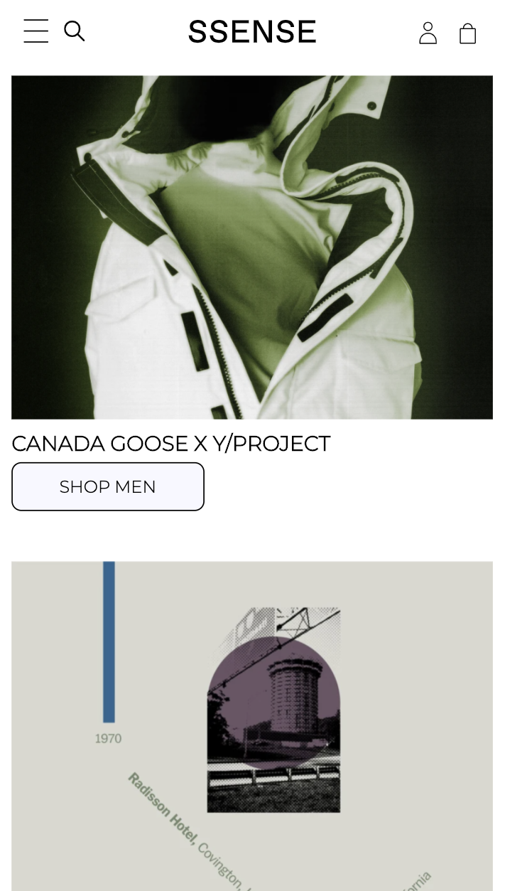
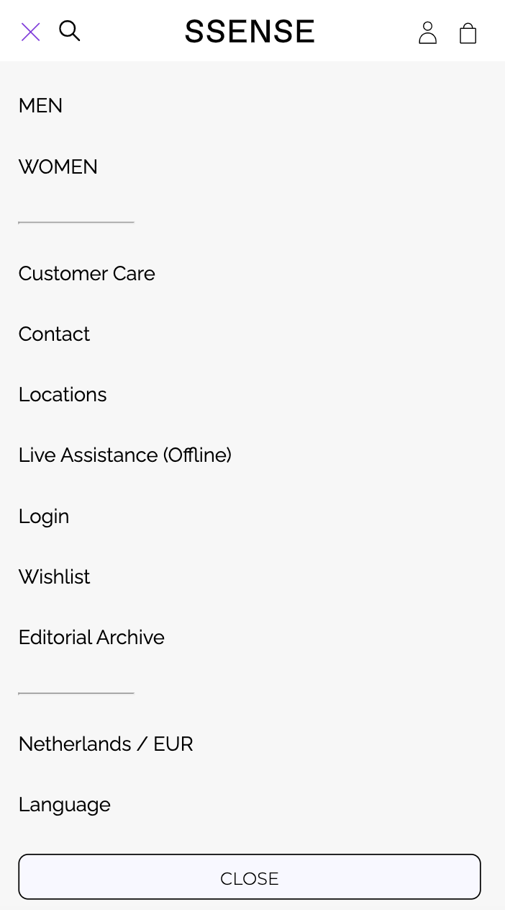
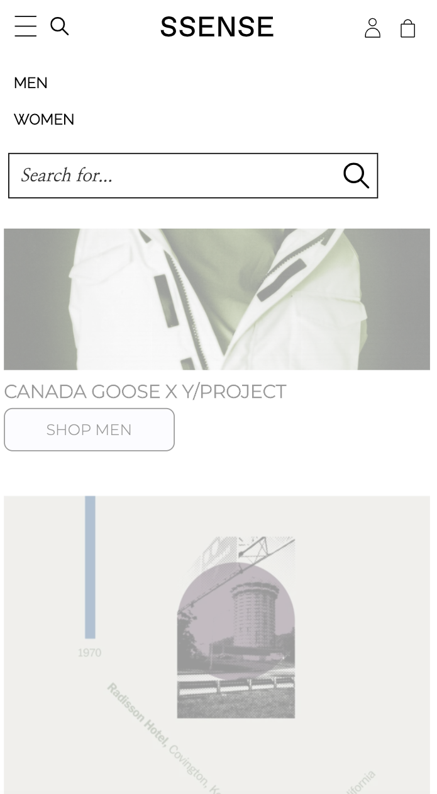
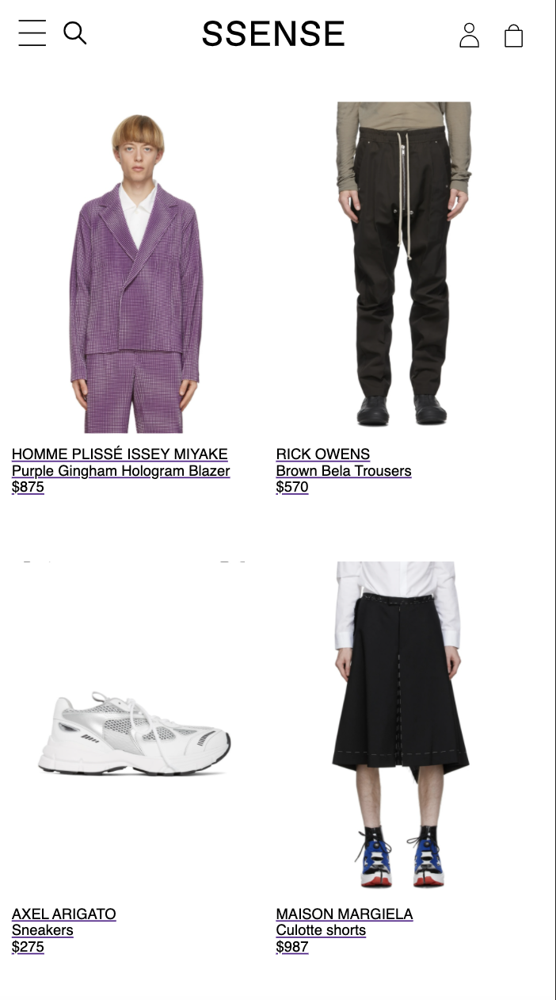

# Procesverslag
**Auteur:** Saphia Nguyen

Markdown cheat cheet: [Hulp bij het schrijven van Markdown](https://github.com/adam-p/markdown-here/wiki/Markdown-Cheatsheet). Nb. de standaardstructuur en de spartaanse opmaak zijn helemaal prima. Het gaat om de inhoud van je procesverslag. Besteedt de tijd voor pracht en praal aan je website.

## Bronnenlijst
1. https://www.ssense.com/en-us (website die ik namaak)
2. https://css-tricks.com/almanac/properties/p/position/ (positioneren)
3. https://www.youtube.com/watch?v=F-mvXKKoSCU (menu animatie)
4. https://css-tricks.com/snippets/css/css-linear-gradient/ (kleur gradient)
5. https://www.w3schools.com/howto/tryit.asp?filename=tryhow_css_tooltip (tooltip)
6. https://codepen.io/shooft/pen/yLOdLBg (de states)

## Eindgesprek (week 7/8)

Dit was lastig:
> Ik vond het erg lastig om mijn hamburger animatie menu te combineren met het menu zelf. Uiteindelijk is het gelukt met wat hulp. Door steeds een paar dingen hier en daar te toe te voegen/verwijderen, kwam het best veel voor dat er op andere plekken ook dingen gingen veranderen. Dat vond ik vrij irritant, maar ook begrijpelijk. Gelukkig viel het allemaal mee en kon ik het ook vrij snel oplossen.

> Ook had ik moeite met het knopje van 'Close' wanneer je het menu weer wil dichtmaken. Op het internet kon ik er ook niet veel over vinden. Ik heb er heel wat mee gestoeid en uiteindelijk was het me toch zelf wel gelukt! Daar was ik ook wel trots op. Ik besef 

Dit ging goed:
> Het opstellen van de pagina's vond ik niet zo lastig. Dus de header, main en footer. Alle elementen daarin plaatsen was wel een dingetje geweest, maar het viel ook wel moe hoe lastig dat was.

**Screenshot(s):**

## Voortgang 3 (week 6)

Vragen groepje:
Naomi: voorbeelden van states 

Tim: voorbeelden van states

Saphia: afbeeldingen na h1, javascript

Joris: naar code kijken effectief? +-10 min. 

Martine: naar code laten kijken

Dit ging goed:
> De artiekelen maken (met titel en afbeeldingen)

> Juiste fonts en font-sizes

> Juiste padding/marges

Dit ging minder goed:
> Spelen met grid

> De juiste samenstellingen van de artikelen uitvinden

> Footer opstellen

> handige link: https://developer.mozilla.org/en-US/docs/Web/CSS/order

## Voortgang 2 (week 5)

Vragen groepje:

Naomi: Javascript toepassen,+- 10 min.

Tim: redused motion, animations activeren,+-10 min.

Saphia: extra uitleg Grids responsive maken, formulieren, Javascript, +- 10 min.

Joris: accordeon,loopen array videos,comments array +-10 min.

Dit ging goed:
> Het opstellen van de grids en de juiste fonts zoeken

> De aafbeeldingen opstellen

> De footer maken

Dit ging minder goed:

> 2 grids naaste elkaar met de tekst op de juiste plek

## Voortgang 1 (week 3)

### Stand van zaken

Goed:
> De header opstellen, met linkjes en een nav bar

> Lettertype uitzoeken

Lastig:
> Logo in het midden plaatsen, met 2 nav bar ernaast

> De juiste padding/margin zoeken voor de nav bar

**Screenshot(s):**

-screenshot(s) van hoe ver je bent-

### Agenda voor meeting

-samen met je groepje opstellen-
> Hoe verander je nav in menu's bij responsiveness
> Hoe kun je een foto in een section het best doen

### Verslag van meeting

De meeting ging goed, ik had niet zoveel vragen, omdat ik nog niet veel had.
Ik heb wel 2 handige sites gekregen om er wat mee te doen; 
https://css-tricks.com/snippets/css/media-queries-for-standard-devices/
https://jonsuh.com/hamburgers/

## Intake (week 1)

**Je startniveau:** Blauwe piste

**Je focus:** Surface plane

**Je opdracht:** https://www.ssense.com/en-us

**Screenshot(s):**

**Breakdown-schets(en):**

