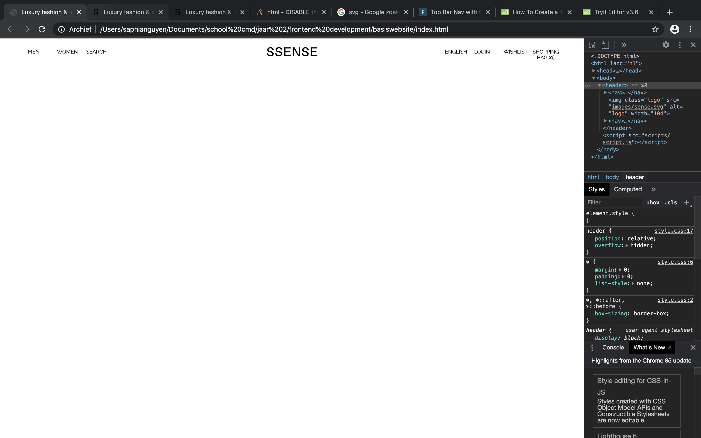
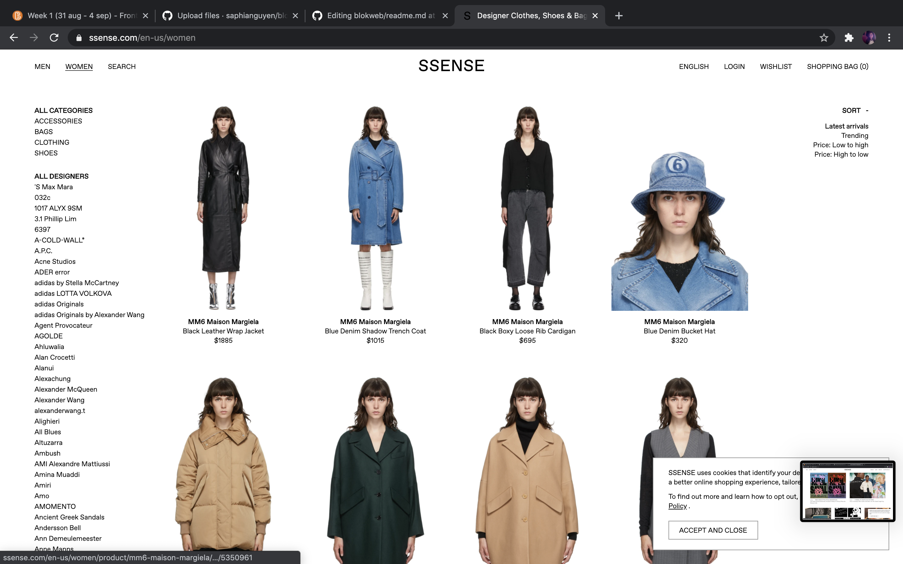
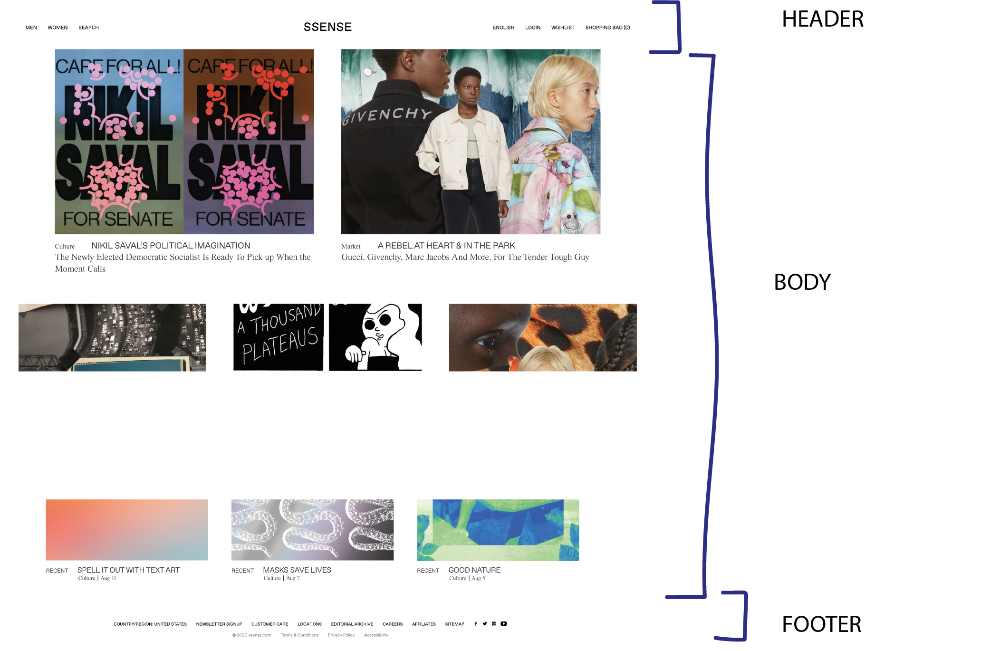

# Procesverslag
**Auteur:** Saphia Nguyen

Markdown cheat cheet: [Hulp bij het schrijven van Markdown](https://github.com/adam-p/markdown-here/wiki/Markdown-Cheatsheet). Nb. de standaardstructuur en de spartaanse opmaak zijn helemaal prima. Het gaat om de inhoud van je procesverslag. Besteedt de tijd voor pracht en praal aan je website.

## Bronnenlijst
1. -bron 1-
2. -bron 2-
3. -...-

## Eindgesprek (week 7/8)

-dit ging goed & dit was lastig-

**Screenshot(s):**

-screenshot(s) van je eindresultaat-

## Voortgang 3 (week 6)

-same as voortgang 1-

## Voortgang 2 (week 5)

Vragen groepje:

Naomi: Javascript toepassen,+- 10 min.

Tim: redused motion, animations activeren,+-10 min.

Saphia: extra uitleg Grids responsive maken, formulieren, Javascript, +- 10 min.

Joris: accordeon,loopen array videos,comments array +-10 min.

Dit ging goed:
> Het opstellen van de grids en de juiste fonts zoeken

> De aafbeeldingen opstellen

> De footer maken

Dit ging minder goed:

> 2 grids naaste elkaar met de tekst op de juiste plek

## Voortgang 1 (week 3)

### Stand van zaken

Goed:
> De header opstellen, met linkjes en een nav bar

> Lettertype uitzoeken

Lastig:
> Logo in het midden plaatsen, met 2 nav bar ernaast

> De juiste padding/margin zoeken voor de nav bar

**Screenshot(s):**

-screenshot(s) van hoe ver je bent-

### Agenda voor meeting

-samen met je groepje opstellen-
> Hoe verander je nav in menu's bij responsiveness

### Verslag van meeting

De meeting ging goed, ik had niet zoveel vragen, omdat ik nog niet veel had.
Ik heb wel 2 handige sites gekregen om er wat mee te doen; 
https://css-tricks.com/snippets/css/media-queries-for-standard-devices/
https://jonsuh.com/hamburgers/

## Intake (week 1)

**Je startniveau:** Blauwe/Rode piste

**Je focus:** Surface plane

**Je opdracht:** https://www.ssense.com/en-us

**Screenshot(s):**

**Breakdown-schets(en):**

